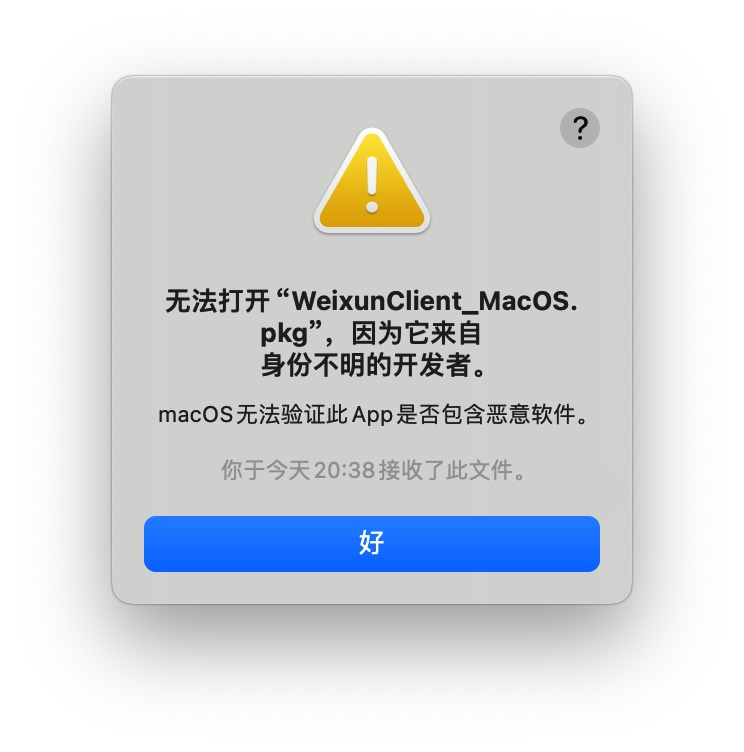

## Mac 使用技巧

- [0. 终端](./terminal.md)
- [Gradle](./gradle.md)
- [常见操作/快捷键](./normal.md)
- [环境变量设置](./env_var.md)
- [安装开发工具](./install_dev_tools.md)
- [升级系统引起的问题](./error_upsystem.md)
- [无法打开 xxx.pkg 因为它来自身份不明的开发者](https://support.apple.com/zh-cn/guide/mac-help/mh40616/mac)
  
  
- [Macbook pro 外接三方显示器问题](./mac_external_display.md)
---

