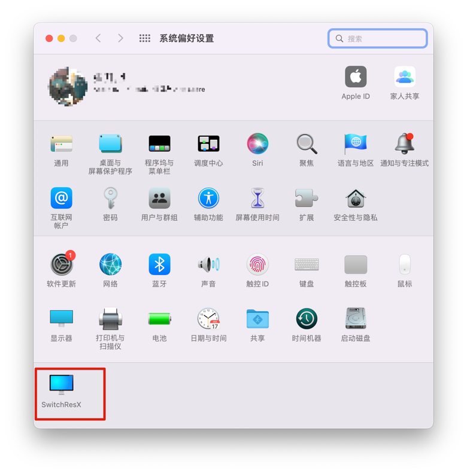
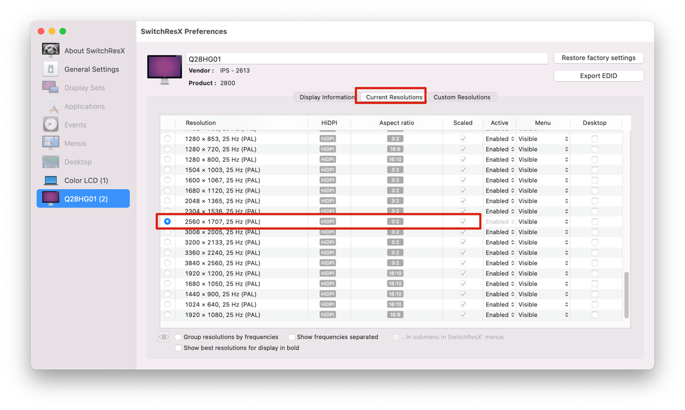

## Macbook pro 外接三方显示器问题

### 环境

- Laptop
    - MacBook Pro (15-inch, 2018)
    - macOS Monterey
- Display:
    - SONGREN 松人 28寸 4k
    - Q28HG01
    - 分辨率: 3840*2560
    
### 问题

在 mac 自带的「显示器」设置中 无法设置匹配的分辨率，导致显示器上下有很宽的黑边；

解决：使用第三方设置工具: switchResX;

我拼多多购买的盗版，放到百度网盘了。
[相关文章--破解版](https://a-nomad.com/mac-resolution)

#### 步骤

- 先安装到「系统偏好设置」中

  
- 选择一个合适的

  
    
